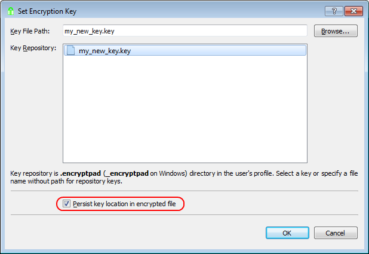
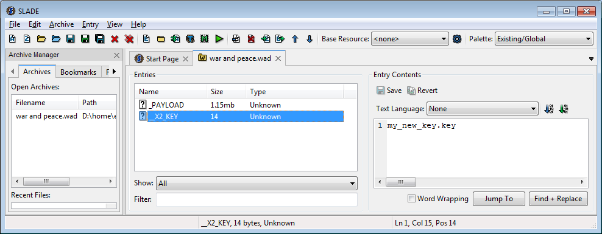

# Ouvrir un fichier texte en clair, le protéger à la fois par phrase de passe et fichier clé et l’enregistrer comme fichier EPD]

## Ouvrir un fichier texte en clair

1\. Cliquer sur le bouton Ouvrir un fichier

2\. Sélectionner le type de fichier Texte en clair et cliquer sur Enregistrer

3\. Le fichier texte en clair ouvert

EncryptPad est maintenant en mode texte en clair non protégé. Elle fonctionne comme un éditeur de texte ordinaire.

## Générer un nouveau fichier

4\. Cliquer sur le bouton Générer une clé

5\. Sélectionner le bouton radio Clé dans le dépôt, saisir `ma_nouvelle_clé` dans la boîte de texte correspondante et cliquer sur OK.

6\. Il vous sera demandé de saisir une phrase de passe pour protéger le fichier clé sur le disque.

Saisir `MdpClé`

7\. Cliquer sur Oui pour utiliser le nouveau fichier clé pour chiffrer votre texte.

8\. Le fichier clé se trouve dans votre répertoire personnel sous `encryptpad`.

Voici le contenu du fichier (il sera différent pour vous, car la clé est aléatoire) :  

`91Oamyib4o+Tbry/4NzoFOWhWpIfQE0TyMHiYtnOK9w=`

C’est une séquence aléatoire en Base64 à partir de laquelle la clé de chiffrement est dérivée.

## Protéger avec le fichier clé et enregistrer comme fichier GPG

9\. Cliquer sur le bouton Enregistrer sous.

10\. Sélectionner le type de fichier EncryptPad (\*.epd) et cliquer sur le bouton Enregistrer.

Veuillez prendre note que le nom de fichier est maintenant `guerre et paix.epd` dans la boîte de dialogue Enregistrer sous.

11\. Il vous sera demandé de saisir une phrase de passer deux fois. Saisir `MdpDémo` pour cet exemple et cliquer sur OK.

Veuillez prendre note que si vous laissez la phrase de passe vide et cliquez sur OK, le fichier ne sera protégé que par le fichier clé et vous ne bénéficierez pas de la double protection. 

12\. Le fichier a maintenant été enregistré sur le disque, chiffré avec le fichier clé généré et la phrase de passe. Voir l’état dans l’image ci-dessous.

## Emplacement de clé persistant dans le fichier chiffré

Maintenant, si vous annulez la protection, fermez le fichier et le rouvrez, la phrase de passe et le fichier clé vous seront demandés. Il pourrait être fastidieux de saisir le chemin du fichier clé chaque fois, particulièrement s’il n’est pas dans le dépôt. Pour faciliter le tout, vous pouvez activer `Emplacement de clé persistante dans le fichier chiffré`. (cette fonction n’est prise en charge que pour le type de fichier EPD).

13\. Cliquer sur le bouton Définir la clé.

14\. Activer `Emplacement de clé persistante dans le fichier chiffré` dans la boîte de dialogue Définir la clé et cliquer sur OK.

15\. La barre d’état a changé (voir l’image ci-dessous).

Si vous effacez la protection et rouvrez ce fichier, l’emplacement du fichier clé ne vous sera pas demandé, car il persiste à même le fichier chiffré. L’emplacement est aussi à l’abri des regards indiscrets, car il est chiffré avec la phrase de passe.

16\. Cliquer sur le bouton Enregistrer pour enregistrer le fichier.

## Ouvrir un autre fichier texte en clair

Si vous tentez d’ouvrir un fichier texte en clair maintenant, cela échouera avec le message suivant :

EncryptPad pense que le fichier est chiffré avec une phrase de passe et un fichier clé, car son mode est `Protégé par une clé` et `Protégé par phrase de passe`, comme vous pouvez le voir dans la barre d’état. Elle a tenté de déchiffrer le texte en clair et a échoué. Pour poursuivre l’ouverture du fichier, effacez la protection par phrase de passe et fichier clé en cliquant sur les boutons Effacer la clé de chiffrement et Effacer la phrase de passe, ou mieux encore, en cliquant sur Fermer et réinitialiser» ce qui fermera le fichier texte et réinitialisera les deux parties de la protection.

Vous pouvez maintenant ouvrir votre fichier texte en clair.

## Le fonctionnement interne du fichier EPD

Le fichier EPD est un fichier OpenPGP contenant un fichier [WAD](https://fr.wikipedia.org/wiki/.wad) qui contient un autre fichier OpenPGP. Il y a trois niveaux d’imbrication. Pour le démontrer, nous pouvons extraire le fichier chiffré sans utiliser EncryptPad.

17\. Renommer le fichier `guerre et paix.epd` en `guerre et paix.gpg`.

18\. Déchiffrer le fichier avec [Gpg4Win](https://www.gpg4win.org/). Utilisez `MdpDémo` comme phrase de passe.

19\. Renommer le fichier produit par Kleopatra de `guerre et paix` en `guerre_et_paix.wad`.

20\. Pour la prochaine étape, il vous faut obtenir un outil pour travailler avec les fichiers WAD. Je recommande [Slade](https://github.com/sirjuddington/SLADE).

21\. Extraire le contenu du fichier WAD avec Slade. Voir la fenêtre ci-dessous pour plus de détails.

Noter que le fichier `__X2_KEY` contient le nom de notre fichier clé `ma_nouvelle_clé.key`. `_PAYLOAD` est le fichier OpenPGP chiffré avec le fichier clé. 

22\. Enregistrer `PAYLOAD` sur le disque. Cliquer sur Entrée->Exporter et enregistrer le fichier sous **guerre et paix.gpg**. Écraser les fichiers existants que nous avons utilisés dans les étapes précédentes.

23\. Déchiffrer le fichier clé `ma_nouvelle_clé` avec [Gpg4Win](https://www.gpg4win.org/). Utiliser `MdpClé` comme phrase de passe.

24\. Maintenant que nous avons la clé non chiffrée, déchiffrer le fichier de l’étape 22 avec [Gpg4Win](https://www.gpg4win.org/). Utiliser le contenu du fichier clé de l’étape 23 comme phrase de passe.

25\. Le résultat de ce déchiffrement sera votre fichier texte en clair original.